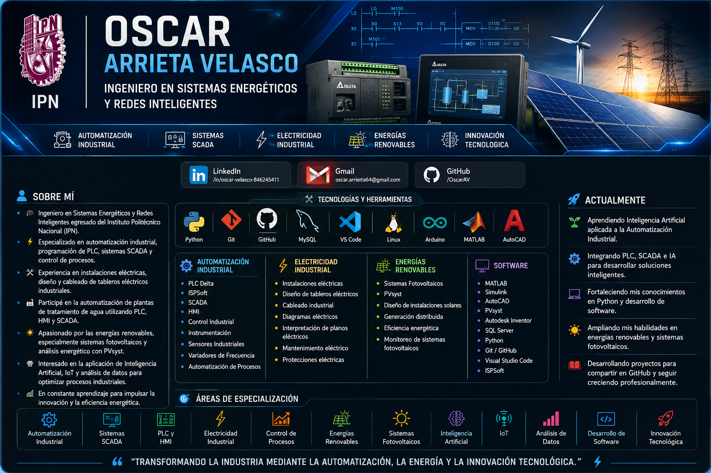

  

<h1 align="center">Hola 👋 Soy Oscar Arrieta Velasco ⚡</h1>
⚡ Ingeniería en Sistemas Energéticos y Redes Inteligentes

Automatización Industrial • PLC • HMI • SCADA • Energías Renovables • IoT • Inteligencia Artificial

  

  

  

---

# 💡 Sobre mí

🎓 **Ingeniero en Sistemas Energéticos y Redes Inteligentes** egresado del **Instituto Politécnico Nacional (IPN).**

⚡ Especializado en **automatización industrial**, programación de **PLC**, desarrollo de sistemas **SCADA** y control de procesos industriales.

🔌 Experiencia en **instalaciones eléctricas**, diseño y cableado de **tableros eléctricos**, interpretación de diagramas eléctricos y mantenimiento industrial.

🏭 Participé en la **automatización de plantas de tratamiento de agua**, implementando soluciones mediante PLC, HMI y SCADA para optimizar procesos industriales.

☀️ Experiencia en **energías renovables**, principalmente sistemas **fotovoltaicos**, análisis energético con **PVsyst** y diseño de soluciones para generación distribuida.

🤖 Interesado en la aplicación de **Inteligencia Artificial**, automatización, IoT y análisis de datos para optimizar procesos industriales.

📫 **Correo:** **oscar.arrierta64@gmail.com**

🌐 **LinkedIn:** https://www.linkedin.com/in/oscar-velasco-846245411/

---

# 🛠 Tecnologías y Herramientas

## ⚡ Experiencia Profesional

| Proyecto | Descripción |
|----------|-------------|
| 🚁 *Dron para la Inspección Inteligente de Sistemas Fotovoltaicos* | Detección de Hot Spots en paneles solares mediante visión térmica, GPS y sensores ambientales. [Ver proyecto](https://github.com/OSCAR-ARRIETA/DRON-INSPECCION-INFRAESTRUCTURA-ELECTRICA) |

| Proyecto | Descripción |
|----------|-------------|
| ⚙️ *Sistema fotovoltaico aislado con almacenamiento* | Diseño y simulación de un sistema fotovoltaico aislado con almacenamiento de energía, desarrollado mediante PVsyst.. [Ver proyecto](https://github.com/OSCAR-ARRIETA/DISENO-SISTEMA-FOTOVOLTAICO-PVSYST) |

                                                                                                                          
| Proyecto | Descripción |
|----------|-------------|
| ⚙️ *Automatización de Planta de Tratamiento de Aguas Residuales* | Sistema de automatización y control mediante PLC Delta, HMI, control de bombas y medidores de flujo (QUERETARO). [Ver proyecto](https://github.com/OSCAR-ARRIETA/AUTOMATIZACION-PLC-QUERETARO) |

| Proyecto | Descripción |
|----------|-------------|
| ⚙️ *Automatización de Planta de Tratamiento de Aguas Residuales* | Sistema de automatización y control mediante PLC Delta, ISPSoft, DOPSoft, Ladder Logic, HMI, control de bombas y monitoreo de medidores de flujo (GUANAJUATO). [Ver proyecto](https://github.com/OSCAR-ARRIETA/AUTOMATIZACION-PLC-GUANAJUATO) |

| Proyecto | Descripción |
|----------|-------------|
| ⚡ *Experiencia Profesional como Electricista Industrial* | Instalación y mantenimiento de sistemas eléctricos industriales, tubería conduit, cableado de fuerza y control, montaje de tableros eléctricos, conexión de motores, bombas, luminarias y equipos industriales. [Ver experiencia](https://github.com/OSCAR-ARRIETA/ELECTRICISTA-INDUSTRIAL) |

## ⚙️ Automatización Industrial

- PLC Delta
- ISPSoft
- SCADA
- HMI
- Control Industrial
- Instrumentación
- Sensores Industriales
- Variadores de Frecuencia
- Automatización de Procesos

---

## ⚡ Electricidad Industrial

- Instalaciones eléctricas
- Diseño de tableros eléctricos
- Cableado industrial
- Interpretación de diagramas eléctricos
- Mantenimiento eléctrico
- Protecciones eléctricas

---

## ☀️ Energías Renovables

- Sistemas Fotovoltaicos
- PVsyst
- Diseño de instalaciones solares
- Generación distribuida
- Eficiencia energética
- Monitoreo de sistemas fotovoltaicos

---

## 💻 Software

- MATLAB
- Simulink
- AutoCAD
- PVsyst
- Autodesk Inventor
- SQL Server
- Python
- Git
- GitHub
- Visual Studio Code
- ISPSoft

---

# 🚀 Actualmente

- 🌱 Aprendiendo Inteligencia Artificial aplicada a la Automatización Industrial.
- ⚙️ Integrando PLC, SCADA e IA para desarrollar soluciones inteligentes.
- 🤖 Fortaleciendo mis conocimientos en Python y desarrollo de software.
- ☀️ Ampliando mis habilidades en energías renovables y sistemas fotovoltaicos.
- 📚 Construyendo un portafolio profesional en GitHub.

---

# 🎯 Áreas de Especialización

- ⚙️ Automatización Industrial
- 🖥️ Sistemas SCADA
- 🔌 PLC y HMI
- ⚡ Electricidad Industrial
- 📈 Control de Procesos
- ☀️ Energías Renovables
- 🔋 Sistemas Fotovoltaicos
- 🤖 Inteligencia Artificial
- 🌐 Internet de las Cosas (IoT)
- 📊 Análisis de Datos
- 💻 Desarrollo de Software
- 🚀 Innovación Tecnológica

---

<h3 align="center">
⚡ "Transformando la industria mediante la automatización, la energía y la innovación tecnológica." ⚡
</h3>
